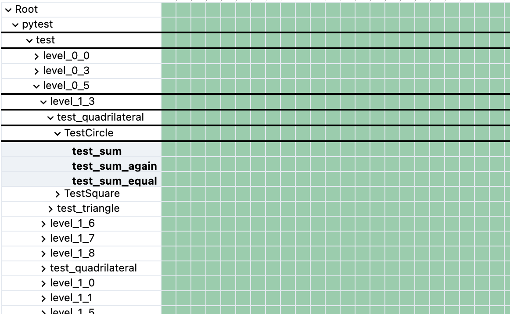

# Example python test suite

This generates a suite of tests that are used to generate a demo test report.

## Quickstart

We will download the testrecall-reporter CLI. Afterwards we will run our test suite, that outputs a `report.xml` output. Finally we upload the results using the testrecall reporter.

### Setup

```bash
python3 -m venv .venv
source .venv/bin/activate
python3 -m pip install -r requirements.txt
```

### Run tests and upload results

```bash
curl -sL https://get.testrecall.com/reporter | bash
export TR_UPLOAD_TOKEN="fill_me_in"

pytest --junit-xml=report.xml

testrecall-reporter
```

You should now see something like this in your project view!


